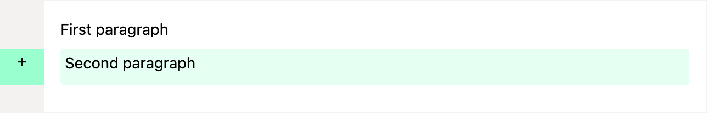
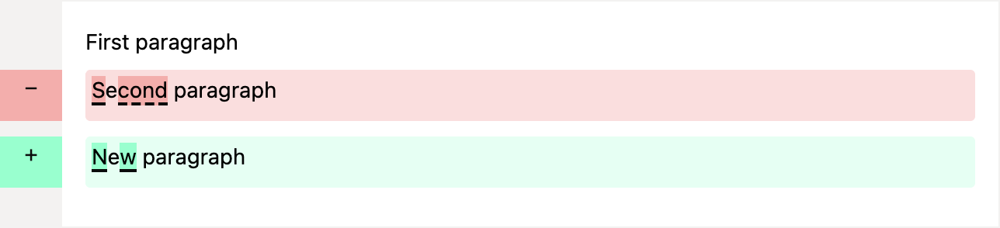

# Nokodiff

A Ruby Gem to highlight additions, deletions and character level changes while preserving original HTML.

It includes functionality to:
* Compare two HTML fragments and output diffs with semantic HTML
* Inline character differences highlighting using `<strong>` tagging
* Blocks of added or removed content wrapped in aria labelled `<ins>` and `<del>` tags
* Optional CSS for styling the visual differences

## Installation

Install the gem:

```
gem install nokodiff
```

or add it to your Gemfile

```
gem "nokodiff"
```

## Usage

In the controller:
```ruby
require 'nokodiff'

before_html = < YOUR HTML >
after_html = < YOUR HTML >

@differ = Nokodiff.diff(before_html, after_html)
```

In the erb file:
```erb
<div>
  <%= @differ %>
</div>
```

### Including the CSS

In your application.scss file include:
```scss
@import "nokodiff";
```

This will include the styling for `<del>`, `<ins>` and `<strong>` tags to allow colour coding, highlighting and underlining of changes.

### More complex diffing with `data-diff-key`

For more complex HTML structures, a standard diff can produce surprising or misleading results when elements are added, removed, or reordered. To get around this, add a `data-diff-key` attribute to elements you want compared in isolation.

Each element with a unique `data-diff-key` value is diffed independently against its counterpart in the other HTML fragment. This prevents unrelated changes from affecting each other and produces more accurate, contextually meaningful output.

The key value can be any unique string — it just needs to match between your `before` and `after` HTML for the elements you want paired together.

#### Adding a new element

When a `data-diff-key` element is present in `after` but not in `before`, its content is wrapped in an `<ins>` tag:

```ruby
before = <<~HTML
  <div>
    <div data-diff-key="ixn4">
      <p>First paragraph</p>
    </div>
  </div>
HTML

after = <<~HTML
  <div>
    <div data-diff-key="ixn4">
      <p>First paragraph</p>
    </div>
    <div data-diff-key="zm7q">
      <p>Second paragraph</p>
    </div>
  </div>
HTML

Nokodiff.diff(before, after)
```

Output:

```html
<div>
  <div data-diff-key="ixn4">
    <p>First paragraph</p>
  </div>
  <div data-diff-key="zm7q">
    <div class="diff">
      <ins aria-label="added content"><p>Second paragraph</p></ins>
    </div>
  </div>
</div>
```



#### Modifying an existing element

When a `data-diff-key` element exists in both fragments but its content has changed, the element is diffed in isolation. Character-level changes are highlighted within `<del>` and `<ins>` tags:

```ruby
before = <<~HTML
  <div>
    <div data-diff-key="ixn4">
      <p>First paragraph</p>
    </div>
    <div data-diff-key="zm7q">
      <p>Second paragraph</p>
    </div>
  </div>
HTML

after = <<~HTML
  <div>
    <div data-diff-key="ixn4">
      <p>First paragraph</p>
    </div>
    <div data-diff-key="zm7q">
      <p>New paragraph</p>
    </div>
  </div>
HTML

Nokodiff.diff(before, after)
```

Output:

```html
<div>
  <div data-diff-key="ixn4"><p>First paragraph</p></div>
  <div data-diff-key="zm7q">
    <div class="diff">
      <del aria-label="removed content"><p><strong>S</strong>e<strong>cond</strong> paragraph</p></del>
    </div>
    <div class="diff">
      <ins aria-label="added content"><p><strong>N</strong>e<strong>w</strong> paragraph</p></ins>
    </div>
  </div>
</div>
```



#### Unchanged elements

If a `data-diff-key` element's content is identical in both fragments, no diff markup is added and the element is returned as-is.

#### Limitations

Currently, the gem does not support highlighting removed `data-diff-key` elements. If a keyed element is present in `before` but absent from `after`, it will not be marked as deleted in the output.

Thanks to [HTML Diff](https://html-diff.lix.dev/index.html) for inspiring this approach!

## Licence

The gem is available as open source under the terms of the [MIT License.](https://opensource.org/license/MIT)
